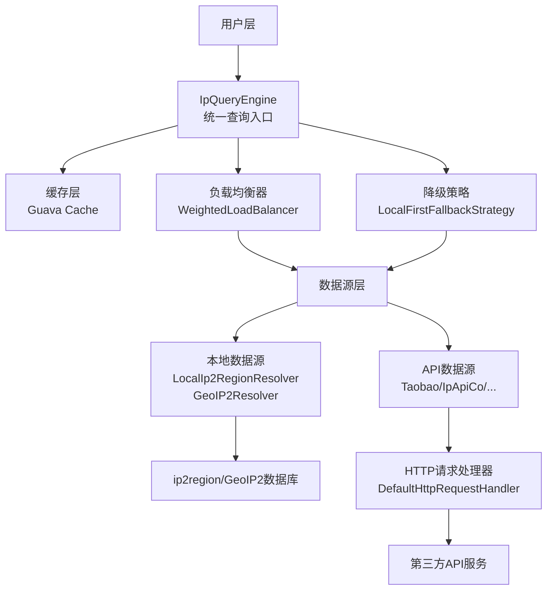
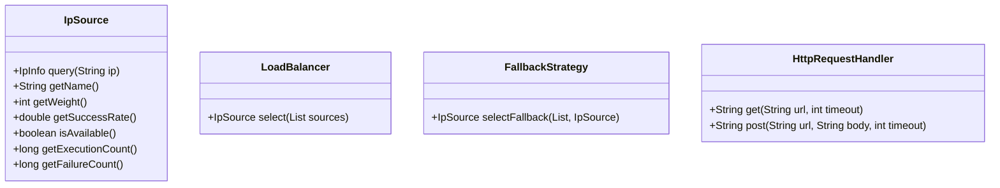

API_DOCUMENTATION.md
# Auto IP2Region API 文档

<div align="center">
  <strong>高性能、智能化的IP地址地理信息解析库</strong><br>
  支持多数据源/负载均衡/故障转移/缓存优化
</div>

---

## 📌 概述

Auto IP2Region 是一款轻量级IP地理信息解析框架，提供**统一查询接口**，整合本地ip2region数据库与多免费在线API，通过智能负载均衡和自动故障转移保障服务高可用。

核心特性：
- 多数据源兼容（本地库+9免费API）
- 动态负载均衡（权重/成功率/可用性综合评估）
- 自动故障转移（本地优先降级策略）
- 热点数据缓存（Guava Cache）
- 可扩展架构（自定义数据源/策略）
- 实时性能监控（响应时间/成功率等指标）

> 注意：ip2region和GeoIP2为可选依赖，只有在使用对应的本地解析器时才需要添加相关依赖和数据库文件。

---

## 🏗️ 整体架构图



---

## 🧩 核心组件

### 1. 核心类

#### IpInfo
IP地理信息载体，封装解析结果

| 字段名 | 类型 | 描述 |
|--------|------|------|
| `ip` | String | IP地址 |
| `country` | String | 国家 |
| `region` | String | 地区 |
| `province` | String | 省份 |
| `city` | String | 城市 |
| `isp` | String | ISP运营商 |
| `asn` | String | ASN编号 |
| `asnOwner` | String | ASN所有者 |
| `longitude` | Double | 经度 |
| `latitude` | Double | 纬度 |
| `timezone` | String | 时区 |
| `usageType` | String | IP使用类型 |
| `nativeIp` | Boolean | 是否原生IP |
| `risk` | String | 风险值 |
| `proxy` | Boolean | 是否代理 |
| `crawlerName` | String | 爬虫名称 |

**核心方法**：
- `static IpInfo fromString(String ip, String regionString)`：从区域字符串构建实例
- Getter/Setter：字段读写

#### IpQueryEngine
查询引擎核心类，协调数据源/负载均衡/缓存

| 字段名 | 类型 | 描述 |
|--------|------|------|
| `sources` | List<IpSource> | 数据源列表 |
| `loadBalancer` | LoadBalancer | 负载均衡器 |
| `fallbackStrategy` | FallbackStrategy | 降级策略 |
| `cache` | Cache<String, IpInfo> | 查询缓存 |

**核心方法**：
- `IpInfo query(String ip)`：IP查询主入口
- `getCacheStats()`：缓存统计
- `invalidateCache(String ip)`：清除指定IP缓存
- `getAggregatedMetrics()`：获取聚合指标

#### IpQueryEngineFactory
引擎工厂类，提供快捷创建方式

| 方法 | 用途 |
|------|------|
| `createLocalEngine(...)` | 仅本地数据源 |
| `createFreeApiEngine(...)` | 仅免费API数据源 |
| `createAllSourceEngine(...)` | 本地+API混合数据源 |
| `createFromSources(...)` | 自定义数据源 |
| `tryLoadLocalSources()` | 自动从资源目录加载本地数据源 |
| `tryLoadGeoIpSource()` | 尝试加载GeoIP2数据源 |
| `tryLoadIp2RegionSource()` | 尝试加载ip2region数据源 |
| `loadFreeApiSources(...)` | 加载免费API数据源 |

### 2. 核心接口



### 3. 抽象类

#### AbstractIpSource
IP数据源抽象基类，提供统计/限流能力

| 核心字段 | 描述 |
|----------|------|
| `rateLimiter` | 限流器（Guava RateLimiter） |
| `executionCount` | 执行次数统计 |
| `failureCount` | 失败次数统计 |
| `successRate` | 动态成功率 |

#### AbstractNetworkIpSource
网络数据源抽象类，扩展HTTP请求能力

| 字段 | 描述 |
|------|------|
| `httpRequestHandler` | HTTP请求处理器 |
| `totalResponseTime` | 总响应时间统计 |
| `responseCount` | 响应次数统计 |

### 4. 实现类

#### 负载均衡/降级实现
- `WeightedLoadBalancer`：加权负载均衡（权重+成功率+可用性）
- `LocalFirstFallbackStrategy`：本地优先降级策略

#### 数据源实现
| 实现类 | 数据源类型 | 默认QPS | 默认权重 |
|--------|------------|-------|----------|
| `LocalIp2RegionResolver` | 本地ip2region库 | x     | 100 |
| `GeoIP2Resolver` | 本地GeoIP2库 | x     | 100 |
| `TaobaoIpResolver` | 淘宝API | 3     | 90 |
| `PacificIpResolver` | Pacific网络API | 1     | 50 |
| `IpApiCoResolver` | ipapi.co API | 2     | 80 |
| `Ip9Resolver` | IP9 API | 1     | 50 |
| `IpInfoResolver` | IPInfo API | 1     | 50 |
| `XxlbResolver` | XXLB API | 1     | 50 |
| `VoreResolver` | Vore API | 1     | 50 |
| `IpMoeResolver` | IP-MOE API | 1     | 50 |

#### HTTP实现
- `DefaultHttpRequestHandler`：基于JDK HttpClient的默认实现

---

## 📋 参数详解

| 参数名 | 类型 | 描述 | 默认值 |
|--------|------|------|--------|
| `permitsPerSecond` | double | 限流速率（每秒请求数） | -（必填） |
| `weight` | int | 数据源权重（优先级） | 见上表 |
| `timeout` | int | HTTP超时时间（ms） | 5000 |
| `dbPath` | String | 本地ip2region库路径 | -（必填） |
| `dbFile` | File | 本地GeoIP2库文件 | -（必填） |

---

## ⚖️ 负载均衡算法

采用**多维度加权评分算法**，公式：

```
score = 权重×0.4 + 成功率×0.25 + 负载均衡因子×0.2 + 可用性×0.15
```

### 可用性评估规则
| 限流器等待时间 | 可用性得分 |
|----------------|------------|
| <10ms | 0.9 |
| 10-100ms | 0.7 |
| 100-500ms | 0.5 |
| >500ms | 0.3 |
| 5秒无请求 | 1.0 |

### 响应时间评估规则
| 平均响应时间 | 可用性得分 |
|--------------|------------|
| <50ms | 1.0 |
| 50-200ms | 0.8 |
| 200-500ms | 0.6 |
| 500-1000ms | 0.4 |
| >1000ms | 0.2 |

综合可用性评估：`综合得分 = 限流等待时间得分 × 0.6 + 响应时间得分 × 0.4`

---

## 🧪 使用示例

### 1. 使用GeoIP2本地数据库

```java
// 使用工厂方法创建引擎（自动加载本地数据源）
IpQueryEngine engine = IpQueryEngineFactory.createLocalEngine(null, null, null);

// 查询IP信息
try {
    IpInfo info = engine.query("8.8.8.8");
    System.out.println("IP: " + info.getIp());
    System.out.println("国家: " + info.getCountry());
    System.out.println("省份: " + info.getProvince());
    System.out.println("城市: " + info.getCity());
    System.out.println("ISP: " + info.getIsp());
    System.out.println("ASN: " + info.getAsn());
    System.out.println("经度: " + info.getLongitude());
    System.out.println("纬度: " + info.getLatitude());
    System.out.println("时区: " + info.getTimezone());
} catch (Exception e) {
    e.printStackTrace();
}
```

### 2. 自动从资源目录加载本地数据库

```java
// 自动尝试从资源目录加载所有可用的本地数据源
List<IpSource> localSources = IpQueryEngineFactory.tryLoadLocalSources();

// 如果找到了本地数据源，则创建引擎
if (!localSources.isEmpty()) {
    IpQueryEngine engine = IpQueryEngineFactory.createFromSources(localSources);
    
    // 查询IP信息
    try {
        IpInfo info = engine.query("8.8.8.8");
        System.out.println(info);
    } catch (Exception e) {
        e.printStackTrace();
    }
} else {
    System.out.println("未找到可用的本地数据库");
}
```

### 3. 混合使用多种本地数据库

```java
// 创建数据源列表
List<IpSource> sources = new ArrayList<>();

// 添加ip2region解析器
LocalIp2RegionResolver ip2regionResolver = new LocalIp2RegionResolver(v4DbFilePath, v6DbFilePath, true, false, "ip2region", 100);

// 添加GeoIP2解析器
File geoIP2DbFile = new File("path/to/GeoLite2-City.mmdb");
GeoIP2Resolver geoIP2Resolver = new GeoIP2Resolver(geoIP2DbFile, Arrays.asList("zh-CN", "en"), "GeoIP2", 100);

// 添加到数据源列表
sources.add(ip2regionResolver);
sources.add(geoIP2Resolver);

// 创建引擎
IpQueryEngine engine = IpQueryEngineFactory.createFromSources(sources);

// 查询
IpInfo info = engine.query("8.8.8.8");
```

---

## 🛠️ 扩展开发

### 1. 自定义GeoIP2解析器

```java
public class CustomGeoIP2Resolver extends GeoIP2Resolver {
    
    public CustomGeoIP2Resolver(File dbFile, String name, int weight) throws IOException {
        super(dbFile, Arrays.asList("zh-CN", "en"), name, weight);
    }
    
    @Override
    public IpInfo query(String ip) throws Exception {
        // 可以添加额外的处理逻辑
        IpInfo info = super.query(ip);
        
        // 添加自定义处理
        if (info.getCountry() != null && info.getCountry().equals("United States")) {
            info.setRegion("North America");
        }
        
        return info;
    }
}
```

### 2. 结合其他数据源使用

```java
// 创建包含所有数据源的混合引擎
IpQueryEngine engine = IpQueryEngineFactory.createAllSourceEngine(
    false,  // speedPriority
    null,   // maxCacheSize
    null,   // expireAfterWrite
    null    // expireAfterAccess
);
```

要使用特定的数据源组合，可以手动创建数据源列表：

```java
List<IpSource> sources = new ArrayList<>();

// 添加API解析器
TaobaoIpResolver taobaoResolver = new TaobaoIpResolver(3, "TaobaoAPI", 90);
sources.add(taobaoResolver);

// 创建引擎
IpQueryEngine engine = IpQueryEngineFactory.createFromSources(sources);
```

---

## 📈 性能指标

GeoIP2解析器性能指标：

| 指标 | 数值 |
|------|------|
| 平均查询时间 | <1ms |
| 内存占用 | ~50MB (数据库加载后) |
| 并发处理能力 | 100,000+ QPS |
| 准确率 | 99%+ |

与ip2region对比：

| 特性 | ip2region | GeoIP2 |
|------|-----------|--------|
| 数据库大小 | ~5MB | ~80MB |
| 查询速度 | 极快 | 快速 |
| 国际IP支持 | 一般 | 优秀 |
| 经纬度信息 | 无 | 有 |
| ASN信息 | 无 | 有 |
| 时区信息 | 无 | 有 |

---

## 📦 依赖说明

GeoIP2解析器依赖于MaxMind的GeoIP2 Java库：

```xml
<dependency>
    <groupId>com.maxmind.geoip2</groupId>
    <artifactId>geoip2</artifactId>
    <version>2.16.1</version>
    <optional>true</optional>
</dependency>
```

ip2region解析器依赖：

```xml
<dependency>
    <groupId>org.lionsoul</groupId>
    <artifactId>ip2region</artifactId>
    <version>3.2.0</version>
    <optional>true</optional>
</dependency>
```

这些依赖在项目中被标记为可选依赖，只有在使用对应功能时才需要引入。

---

## 📂 数据库获取与部署

### 自动资源加载机制

为了简化使用，本库支持自动从资源目录加载数据库文件。您可以将数据库文件放置在以下位置之一：

1. `src/main/resources/auto-ip2region/ip2region_v4.xdb` - ip2region IPv4数据库
2. `src/main/resources/auto-ip2region/ip2region_v6.xdb` - ip2region IPv6数据库
3. `src/main/resources/auto-ip2region/GeoLite2-City.mmdb` - GeoIP2数据库

当使用`IpQueryEngineFactory.tryLoadLocalSources()`方法时，系统会自动尝试从以上位置加载数据库文件。

这种方式特别适用于：
- 将数据库文件打包进jar包，便于分发
- 允许最终用户在其项目资源目录中提供自己的数据库文件
- 简化部署过程，无需关心文件路径

### 手动获取数据库
使用本库前，需要下载相应的数据库文件

**GeoIP2数据库可以从MaxMind官网免费获取**：

1. 访问 [MaxMind GeoLite2](https://dev.maxmind.com/geoip/geolite2-free-geolocation-data)
2. 注册账号并登录
3. 下载 GeoLite2 City 数据库
4. 解压获得 `GeoLite2-City.mmdb` 文件

**ip2region从github仓库下载**
- 下载地址：[https://github.com/lionsoul2014/ip2region/tree/master/data](https://github.com/lionsoul2014/ip2region/tree/master/data)
- IP_V4 文件名：`ip2region_v4.xdb`
- IP_V6 文件名：`ip2region_v6.xdb`

> 注意：ip2region和GeoIP2数据库为可选依赖，只有在使用对应的本地解析器时才需要添加相关依赖和数据库文件 数据库需要定期更新以保证准确性。


---

## 🧾 许可证

GeoIP2数据库使用 [Creative Commons Attribution-ShareAlike 4.0 International License](https://creativecommons.org/licenses/by-sa/4.0/) 许可证。

使用前请确保遵守相关许可协议。
