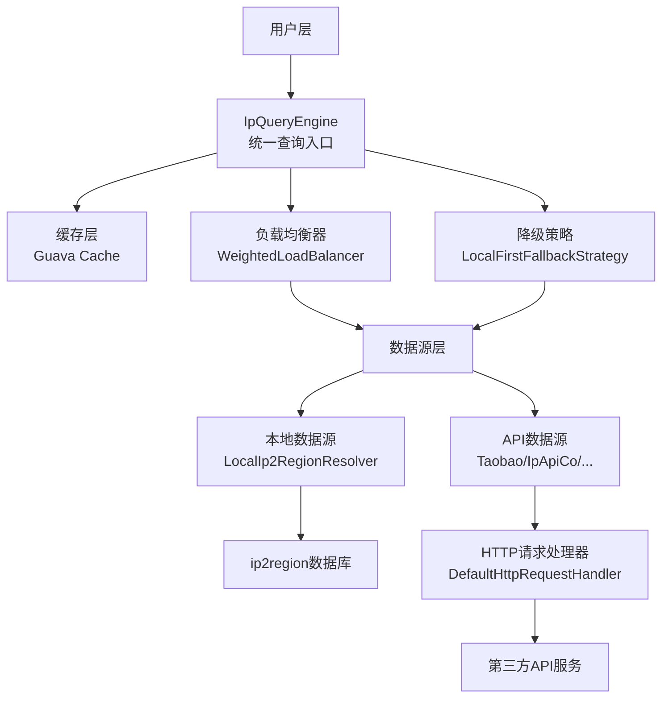
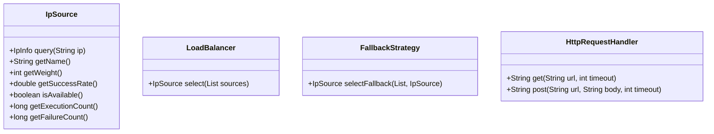
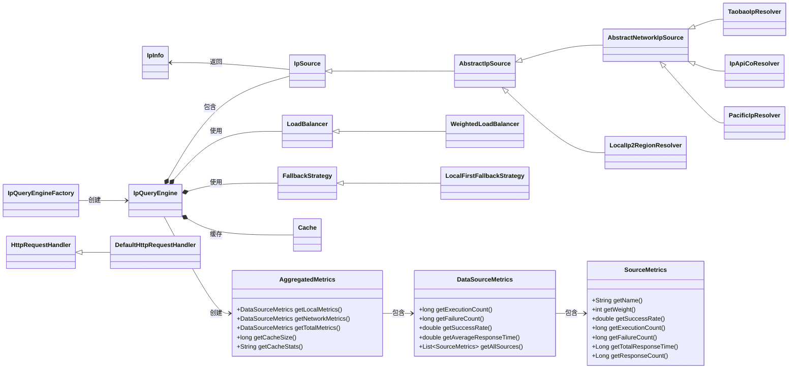

# Auto IP2Region API 文档

<div align="center">
  <strong>高性能、智能化的IP地址地理信息解析库</strong><br>
  支持多数据源/负载均衡/故障转移/缓存优化
</div>

---

## 📌 概述

Auto IP2Region 是一款轻量级IP地理信息解析框架，提供**统一查询接口**，整合本地ip2region数据库与多免费在线API，通过智能负载均衡和自动故障转移保障服务高可用。

核心特性：
- 多数据源兼容（本地库+6+免费API）
- 动态负载均衡（权重/成功率/可用性综合评估）
- 自动故障转移（本地优先降级策略）
- 热点数据缓存（Guava Cache）
- 可扩展架构（自定义数据源/策略）
- 实时性能监控（响应时间/成功率等指标）

---

## 🏗️ 整体架构图



---

## 🧩 核心组件

### 1. 核心类

#### IpInfo
IP地理信息载体，封装解析结果

| 字段名 | 类型 | 描述 |
|--------|------|------|
| `ip` | String | IP地址 |
| `country` | String | 国家 |
| `region` | String | 地区 |
| `province` | String | 省份 |
| `city` | String | 城市 |
| `isp` | String | ISP运营商 |

**核心方法**：
- `static IpInfo fromString(String ip, String regionString)`：从区域字符串构建实例
- Getter/Setter：字段读写

#### IpQueryEngine
查询引擎核心类，协调数据源/负载均衡/缓存

| 字段名 | 类型 | 描述 |
|--------|------|------|
| `sources` | List<IpSource> | 数据源列表 |
| `loadBalancer` | LoadBalancer | 负载均衡器 |
| `fallbackStrategy` | FallbackStrategy | 降级策略 |
| `cache` | Cache<String, IpInfo> | 查询缓存 |

**核心方法**：
- `IpInfo query(String ip)`：IP查询主入口
- `getCacheStats()`：缓存统计
- `invalidateCache(String ip)`：清除指定IP缓存
- `getAggregatedMetrics()`：获取聚合指标

#### IpQueryEngineFactory
引擎工厂类，提供快捷创建方式

| 方法 | 用途 |
|------|------|
| `createWithLocalSource(...)` | 仅本地数据源 |
| `createWithFreeApiSources(...)` | 仅免费API数据源 |
| `createWithMixedSources(...)` | 本地+API混合数据源 |
| `createWithCustomSources(...)` | 自定义数据源 |

### 2. 核心接口



### 3. 抽象类

#### AbstractIpSource
IP数据源抽象基类，提供统计/限流能力

| 核心字段 | 描述 |
|----------|------|
| `rateLimiter` | 限流器（Guava RateLimiter） |
| `executionCount` | 执行次数统计 |
| `failureCount` | 失败次数统计 |
| `successRate` | 动态成功率 |

#### AbstractNetworkIpSource
网络数据源抽象类，扩展HTTP请求能力

| 字段 | 描述 |
|------|------|
| `httpRequestHandler` | HTTP请求处理器 |
| `totalResponseTime` | 总响应时间统计 |
| `responseCount` | 响应次数统计 |

### 4. 实现类

#### 负载均衡/降级实现
- `WeightedLoadBalancer`：加权负载均衡（权重+成功率+可用性）
- `LocalFirstFallbackStrategy`：本地优先降级策略

#### 数据源实现
| 实现类 | 数据源类型 | 权重 |
|--------|------------|------|
| `LocalIp2RegionResolver` | 本地ip2region库 | 100 |
| `TaobaoIpResolver` | 淘宝API | 90 |
| `PacificIpResolver` | Pacific网络API | 85 |
| `IpApiCoResolver` | ipapi.co API | 80 |
| `Ip9Resolver` | IP9 API | 75 |
| `IpInfoResolver` | IPInfo API | 70 |
| `XxlbResolver` | XXLB API | 70 |

#### HTTP实现
- `DefaultHttpRequestHandler`：基于JDK HttpClient的默认实现

---

## 📋 参数详解

| 参数名 | 类型 | 描述 | 默认值 |
|--------|------|------|--------|
| `permitsPerSecond` | double | 限流速率（每秒请求数） | -（必填） |
| `weight` | int | 数据源权重（优先级） | 见上表 |
| `timeout` | int | HTTP超时时间（ms） | 5000 |
| `dbPath` | String | 本地ip2region库路径 | -（必填） |

---

## ⚖️ 负载均衡算法

采用**多维度加权评分算法**，公式：

```
score = 权重×0.4 + 成功率×0.25 + 负载均衡因子×0.2 + 可用性×0.15
```

### 可用性评估规则
| 限流器等待时间 | 可用性得分 |
|----------------|------------|
| <10ms | 0.9 |
| 10-100ms | 0.7 |
| 100-500ms | 0.5 |
| >500ms | 0.3 |
| 5秒无请求 | 1.0 |

### 响应时间评估规则
| 平均响应时间 | 可用性得分 |
|--------------|------------|
| <50ms | 1.0 |
| 50-200ms | 0.8 |
| 200-500ms | 0.6 |
| 500-1000ms | 0.4 |
| >1000ms | 0.2 |

综合可用性评估：`综合得分 = 限流等待时间得分 × 0.6 + 响应时间得分 × 0.4`

---

## 📊 聚合指标监控

系统提供全面的聚合指标监控功能，通过`AggregatedMetrics`类获取系统运行状态：

### 核心指标类

#### AggregatedMetrics
聚合指标主类，包含所有统计数据

| 方法 | 描述 |
|------|------|
| `getLocalMetrics()` | 获取本地数据源指标 |
| `getNetworkMetrics()` | 获取网络数据源指标 |
| `getTotalMetrics()` | 获取总体指标 |
| `getCacheSize()` | 获取缓存大小 |
| `getCacheStats()` | 获取缓存统计信息 |

#### DataSourceMetrics
数据源指标类，包含执行次数、成功率、响应时间等

| 方法 | 描述 |
|------|------|
| `getExecutionCount()` | 获取执行次数 |
| `getFailureCount()` | 获取失败次数 |
| `getSuccessRate()` | 获取成功率 |
| `getAverageResponseTime()` | 获取平均响应时间（仅网络数据源） |
| `getAllSources()` | 获取所有数据源的详细指标 |

#### SourceMetrics
单个数据源详细指标类

| 方法 | 描述 |
|------|------|
| `getName()` | 获取数据源名称 |
| `getWeight()` | 获取数据源权重 |
| `getSuccessRate()` | 获取数据源成功率 |
| `getExecutionCount()` | 获取执行次数 |
| `getFailureCount()` | 获取失败次数 |
| `getTotalResponseTime()` | 获取总响应时间 |
| `getResponseCount()` | 获取响应次数 |

### 使用示例
```java
// 获取聚合指标
AggregatedMetrics metrics = engine.getAggregatedMetrics();

// 查看本地数据源指标
DataSourceMetrics localMetrics = metrics.getLocalMetrics();
System.out.println("本地数据源执行次数: " + localMetrics.getExecutionCount());

// 查看网络数据源指标
DataSourceMetrics networkMetrics = metrics.getNetworkMetrics();
System.out.println("网络数据源平均响应时间: " + networkMetrics.getAverageResponseTime());

// 查看缓存指标
System.out.println("缓存大小: " + metrics.getCacheSize());

// 查看各数据源详细指标
List<SourceMetrics> sourceMetricsList = networkMetrics.getAllSources();
for (SourceMetrics sourceMetrics : sourceMetricsList) {
    System.out.println("数据源: " + sourceMetrics.getName() + 
                      ", 成功率: " + sourceMetrics.getSuccessRate() + 
                      ", 平均响应时间: " + sourceMetrics.getTotalResponseTime() / sourceMetrics.getResponseCount());
}
```

---

## 📥 缓存机制

- **缓存组件**：Guava Cache
- **缓存范围**：仅网络数据源结果（本地库无需缓存）
- **配置参数**：
    - 最大条目：10000
    - 过期时间：30分钟
    - 统计项：命中率/加载数/失效数

---

## 🔄 故障转移流程

1. 主数据源查询失败 → 触发降级策略
2. 优先选择本地数据源（若存在）
3. 无本地数据源则选择次高权重可用数据源
4. 无可用数据源则抛出异常

---

## 🚀 扩展性设计

| 扩展点 | 实现方式 |
|--------|----------|
| 新数据源 | 实现`IpSource`接口（或继承`AbstractIpSource`） |
| 自定义负载均衡 | 实现`LoadBalancer`接口 |
| 自定义降级策略 | 实现`FallbackStrategy`接口 |
| 自定义HTTP客户端 | 实现`HttpRequestHandler`接口 |

---

## 🎨 UML类关系图



## 🤝 贡献

欢迎任何形式的贡献！如果您有任何建议或发现了bug，请提交[Issue](https://github.com/listener-He/auto-ip2region/issues)或者发起[Pull Request](https://github.com/listener-He/auto-ip2region/pulls)。

### 开发环境搭建

1. 克隆项目：`git clone https://github.com/listener-He/auto-ip2region.git`
2. 导入IDE：使用IntelliJ IDEA或Eclipse导入Maven项目
3. 构建项目：`mvn clean install`

## 📄 许可证

本项目采用Apache License 2.0许可证，详情请见[LICENSE](LICENSE)文件。

## 💬 联系方式

如有任何问题，请联系：
- 邮箱：hehouhui@foxmail.com
- GitHub Issues：[提交问题](https://github.com/listener-He/auto-ip2region/issues)

---
<div align="center">
  Made with ❤️ by Honesty | © 2025 All rights reserved
</div>
