# Auto IP2Region API 文档

<div align="center">
  <strong>高性能、智能化的IP地址地理信息解析库</strong><br>
  支持多数据源/负载均衡/故障转移/缓存优化
</div>

---

## 📌 概述

Auto IP2Region 是一款轻量级IP地理信息解析框架，提供**统一查询接口**，整合本地ip2region数据库与多免费在线API，通过智能负载均衡和自动故障转移保障服务高可用。

核心特性：
- 多数据源兼容（本地库+6+免费API）
- 动态负载均衡（权重/成功率/可用性综合评估）
- 自动故障转移（本地优先降级策略）
- 热点数据缓存（Guava Cache）
- 可扩展架构（自定义数据源/策略）
- 实时性能监控（响应时间/成功率等指标）

> 注意：ip2region和GeoIP2为可选依赖，只有在使用对应的本地解析器时才需要添加相关依赖和数据库文件。

---

## 🏗️ 整体架构图

```mermaid
flowchart TD
    A[用户层] --> B[IpQueryEngine<br/>统一查询入口]
    B --> C[缓存层<br/>Guava Cache]
    B --> D[负载均衡器<br/>WeightedLoadBalancer]
    B --> E[降级策略<br/>LocalFirstFallbackStrategy]
    D --> F[数据源层]
    E --> F
    F --> F1[本地数据源<br/>LocalIp2RegionResolver<br/>GeoIP2Resolver]
    F --> F2[API数据源<br/>Taobao/IpApiCo/...]
    F1 --> G[ip2region/GeoIP2数据库]
    F2 --> H[HTTP请求处理器<br/>DefaultHttpRequestHandler]
    H --> I[第三方API服务]
```



---

## 🧩 核心组件

### 1. 核心类

#### IpInfo
IP地理信息载体，封装解析结果

| 字段名 | 类型 | 描述 |
|--------|------|------|
| `ip` | String | IP地址 |
| `country` | String | 国家 |
| `region` | String | 地区 |
| `province` | String | 省份 |
| `city` | String | 城市 |
| `isp` | String | ISP运营商 |
| `asn` | String | ASN编号 |
| `asnOwner` | String | ASN所有者 |
| `longitude` | Double | 经度 |
| `latitude` | Double | 纬度 |
| `timezone` | String | 时区 |
| `usageType` | String | IP使用类型 |
| `nativeIp` | Boolean | 是否原生IP |
| `risk` | String | 风险值 |
| `proxy` | Boolean | 是否代理 |
| `crawlerName` | String | 爬虫名称 |

**核心方法**：
- `static IpInfo fromString(String ip, String regionString)`：从区域字符串构建实例
- Getter/Setter：字段读写

#### IpQueryEngine
查询引擎核心类，协调数据源/负载均衡/缓存

| 字段名 | 类型 | 描述 |
|--------|------|------|
| `sources` | List<IpSource> | 数据源列表 |
| `loadBalancer` | LoadBalancer | 负载均衡器 |
| `fallbackStrategy` | FallbackStrategy | 降级策略 |
| `cache` | Cache<String, IpInfo> | 查询缓存 |

**核心方法**：
- `IpInfo query(String ip)`：IP查询主入口
- `getCacheStats()`：缓存统计
- `invalidateCache(String ip)`：清除指定IP缓存
- `getAggregatedMetrics()`：获取聚合指标

#### IpQueryEngineFactory
引擎工厂类，提供快捷创建方式

| 方法 | 用途 |
|------|------|
| `createWithLocalSource(...)` | 仅本地ip2region数据源 |
| `createWithGeoIP2Source(...)` | 仅本地GeoIP2数据源 |
| `createWithFreeApiSources(...)` | 仅免费API数据源 |
| `createWithMixedSources(...)` | 本地+API混合数据源 |
| `createWithCustomSources(...)` | 自定义数据源 |

### 2. 核心接口


### 3. 抽象类

#### AbstractIpSource
IP数据源抽象基类，提供统计/限流能力

| 核心字段 | 描述 |
|----------|------|
| `rateLimiter` | 限流器（Guava RateLimiter） |
| `executionCount` | 执行次数统计 |
| `failureCount` | 失败次数统计 |
| `successRate` | 动态成功率 |

#### AbstractNetworkIpSource
网络数据源抽象类，扩展HTTP请求能力

| 字段 | 描述 |
|------|------|
| `httpRequestHandler` | HTTP请求处理器 |
| `totalResponseTime` | 总响应时间统计 |
| `responseCount` | 响应次数统计 |

### 4. 实现类

#### 负载均衡/降级实现
- `WeightedLoadBalancer`：加权负载均衡（权重+成功率+可用性）
- `LocalFirstFallbackStrategy`：本地优先降级策略

#### 数据源实现
| 实现类 | 数据源类型 | 权重 |
|--------|------------|------|
| `LocalIp2RegionResolver` | 本地ip2region库 | 100 |
| `GeoIP2Resolver` | 本地GeoIP2库 | 100 |
| `TaobaoIpResolver` | 淘宝API | 90 |
| `PacificIpResolver` | Pacific网络API | 85 |
| `IpApiCoResolver` | ipapi.co API | 80 |
| `Ip9Resolver` | IP9 API | 75 |
| `IpInfoResolver` | IPInfo API | 70 |
| `XxlbResolver` | XXLB API | 70 |

#### HTTP实现
- `DefaultHttpRequestHandler`：基于JDK HttpClient的默认实现

---

## 📋 参数详解

| 参数名 | 类型 | 描述 | 默认值 |
|--------|------|------|--------|
| `permitsPerSecond` | double | 限流速率（每秒请求数） | -（必填） |
| `weight` | int | 数据源权重（优先级） | 见上表 |
| `timeout` | int | HTTP超时时间（ms） | 5000 |
| `dbPath` | String | 本地ip2region库路径 | -（必填） |
| `dbFile` | File | 本地GeoIP2库文件 | -（必填） |

---

## ⚖️ 负载均衡算法

采用**多维度加权评分算法**，公式：

```
score = 权重×0.4 + 成功率×0.25 + 负载均衡因子×0.2 + 可用性×0.15
```

### 可用性评估规则
| 限流器等待时间 | 可用性得分 |
|----------------|------------|
| <10ms | 0.9 |
| 10-100ms | 0.7 |
| 100-500ms | 0.5 |
| >500ms | 0.3 |
| 5秒无请求 | 1.0 |

### 响应时间评估规则
| 平均响应时间 | 可用性得分 |
|--------------|------------|
| <50ms | 1.0 |
| 50-200ms | 0.8 |
| 200-500ms | 0.6 |
| 500-1000ms | 0.4 |
| >1000ms | 0.2 |

综合可用性评估：`综合得分 = 限流等待时间得分 × 0.6 + 响应时间得分 × 0.4`

---

## 🧪 使用示例

### 1. 使用GeoIP2本地数据库

```java
// 创建GeoIP2解析器
File geoIP2DbFile = new File("path/to/GeoLite2-City.mmdb");
GeoIP2Resolver geoIP2Resolver = new GeoIP2Resolver(geoIP2DbFile, "GeoIP2", 100);

// 或者使用DatabaseReader直接创建
DatabaseReader reader = new DatabaseReader.Builder(geoIP2DbFile).build();
GeoIP2Resolver geoIP2Resolver = new GeoIP2Resolver(reader, "GeoIP2", 100);

// 使用工厂方法创建引擎
IpQueryEngine engine = IpQueryEngineFactory.createWithGeoIP2Source(geoIP2DbFile, 1000);

// 查询IP信息
try {
    IpInfo info = engine.query("8.8.8.8");
    System.out.println("IP: " + info.getIp());
    System.out.println("国家: " + info.getCountry());
    System.out.println("省份: " + info.getProvince());
    System.out.println("城市: " + info.getCity());
    System.out.println("ISP: " + info.getIsp());
    System.out.println("ASN: " + info.getAsn());
    System.out.println("经度: " + info.getLongitude());
    System.out.println("纬度: " + info.getLatitude());
    System.out.println("时区: " + info.getTimezone());
} catch (Exception e) {
    e.printStackTrace();
}
```

### 2. 混合使用多种本地数据库

```java
// 创建数据源列表
List<IpSource> sources = new ArrayList<>();

// 添加ip2region解析器
Searcher ip2regionSearcher = Searcher.newWithBuffer(Searcher.loadContentFromFile("path/to/ip2region.xdb"));
LocalIp2RegionResolver ip2regionResolver = new LocalIp2RegionResolver(ip2regionSearcher, "ip2region", 100);

// 添加GeoIP2解析器
File geoIP2DbFile = new File("path/to/GeoLite2-City.mmdb");
GeoIP2Resolver geoIP2Resolver = new GeoIP2Resolver(geoIP2DbFile, "GeoIP2", 100);

// 添加到数据源列表
sources.add(ip2regionResolver);
sources.add(geoIP2Resolver);

// 创建引擎
IpQueryEngine engine = IpQueryEngineFactory.createWithCustomSources(sources);

// 查询
IpInfo info = engine.query("8.8.8.8");
```

---

## 🛠️ 扩展开发

### 1. 自定义GeoIP2解析器

```java
public class CustomGeoIP2Resolver extends GeoIP2Resolver {
    
    public CustomGeoIP2Resolver(File dbFile, String name, int weight) throws IOException {
        super(dbFile, name, weight);
    }
    
    @Override
    public IpInfo query(String ip) throws Exception {
        // 可以添加额外的处理逻辑
        IpInfo info = super.query(ip);
        
        // 添加自定义处理
        if (info.getCountry() != null && info.getCountry().equals("United States")) {
            info.setRegion("North America");
        }
        
        return info;
    }
}
```

### 2. 结合其他数据源使用

```java
// 创建包含GeoIP2和API数据源的混合引擎
IpQueryEngine engine = IpQueryEngineFactory.createWithAllSources(
    "path/to/ip2region.xdb",  // ip2region数据库路径
    1000,                     // 本地数据源限流速率
    100,                      // 淘宝API限流速率
    100,                      // ipapi.co限流速率
    100,                      // Pacific网络API限流速率
    100,                      // IP9 API限流速率
    100,                      // IPInfo API限流速率
    100,                      // XXLB API限流速率
    100,                      // Vore API限流速率
    100                       // IP-MOE API限流速率
    // 注意：GeoIP2需要手动添加到数据源中
);
```

要使用GeoIP2与API数据源结合，需要手动创建数据源列表：

```java
List<IpSource> sources = new ArrayList<>();

// 添加GeoIP2解析器
File geoIP2DbFile = new File("path/to/GeoLite2-City.mmdb");
GeoIP2Resolver geoIP2Resolver = new GeoIP2Resolver(geoIP2DbFile, "GeoIP2", 100);
sources.add(geoIP2Resolver);

// 添加API解析器
TaobaoIpResolver taobaoResolver = new TaobaoIpResolver(100, "TaobaoAPI", 90);
sources.add(taobaoResolver);

// 创建引擎
IpQueryEngine engine = IpQueryEngineFactory.createWithCustomSources(sources);
```

---

## 📈 性能指标

GeoIP2解析器性能指标：

| 指标 | 数值 |
|------|------|
| 平均查询时间 | <1ms |
| 内存占用 | ~50MB (数据库加载后) |
| 并发处理能力 | 100,000+ QPS |
| 准确率 | 99%+ |

与ip2region对比：

| 特性 | ip2region | GeoIP2 |
|------|-----------|--------|
| 数据库大小 | ~5MB | ~80MB |
| 查询速度 | 极快 | 快速 |
| 国际IP支持 | 一般 | 优秀 |
| 经纬度信息 | 无 | 有 |
| ASN信息 | 无 | 有 |
| 时区信息 | 无 | 有 |

---

## 📦 依赖说明

GeoIP2解析器依赖于MaxMind的GeoIP2 Java库：

```xml
<dependency>
    <groupId>com.maxmind.geoip2</groupId>
    <artifactId>geoip2</artifactId>
    <version>2.16.1</version>
    <optional>true</optional>
</dependency>
```

ip2region解析器依赖：

```xml
<dependency>
    <groupId>org.lionsoul</groupId>
    <artifactId>ip2region</artifactId>
    <version>2.7.0</version>
    <optional>true</optional>
</dependency>
```

这些依赖在项目中被标记为可选依赖，只有在使用对应功能时才需要引入。

---

## 📂 数据库获取

GeoIP2数据库可以从MaxMind官网免费获取：

1. 访问 [MaxMind GeoLite2](https://dev.maxmind.com/geoip/geolite2-free-geolocation-data)
2. 注册账号并登录
3. 下载 GeoLite2 City 数据库
4. 解压获得 `GeoLite2-City.mmdb` 文件

注意：数据库需要定期更新以保证准确性。

---

## 🧾 许可证

GeoIP2数据库使用 [Creative Commons Attribution-ShareAlike 4.0 International License](https://creativecommons.org/licenses/by-sa/4.0/) 许可证。

使用前请确保遵守相关许可协议。