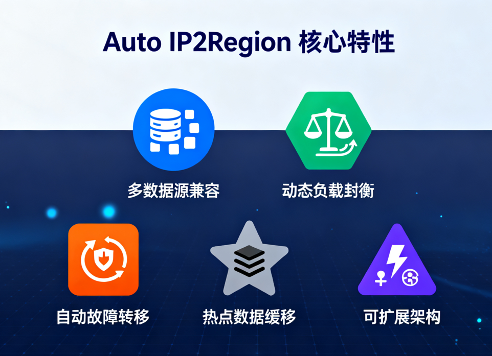

# Auto IP2Region 智能化的IP地理位置解析库
<div align="center">

  [](https://www.apache.org/licenses/LICENSE-2.0)
  [](https://www.oracle.com/java/technologies/javase/jdk17-archive-downloads.html)
  [](https://github.com/listener-He/auto-ip2region/releases)
  [](https://github.com/listener-He/auto-ip2region/blob/main/LICENSE)
  [](https://github.com/listener-He/auto-ip2region/stargazers)
  [](https://github.com/listener-He/auto-ip2region/issues)

</div>

<br/>

Auto IP2Region 是一个智能化的IP地址地理信息解析库，它结合了本地数据库和多个免费在线API服务，通过智能负载均衡和自动故障转移机制，为您提供准确、可靠的IP地理位置信息查询服务。

## 🎯 解决了什么问题？

在实际开发中，我们经常遇到以下痛点：

| 问题 | 传统解决方案 | Auto IP2Region 解决方案 |
|------|-------------|---------------------|
| 单一数据源不稳定 | 固定使用某个API | 多数据源智能切换            |
| 查询性能差 | 同步阻塞调用 | 热点缓存处理              |
| 限流导致失败 | 重试机制 | 智能负载均衡              |
| 数据准确性低 | 无法验证数据质量 | 基于成功率动态调整           |

## ✨ 核心特性

<div align="center">
  
</div>

### ⚡ 高性能
- 基于[ip2region](https://github.com/lionsoul2014/ip2region)本地数据库，查询速度可达**微秒级**
- 使用负载均衡算法，支撑数据准确性
- 内置Guava Cache缓存机制，热点数据访问性能提升**80%+**

### 🔄 智能负载均衡
独特的加权负载均衡算法，综合考虑：
- **权重**(40%) - 静态配置优先级
- **成功率**(25%) - 动态历史成功率
- **执行次数**(20%) - 请求均匀分布
- **可用性**(15%) - 基于限流状态评估

### 🔧 多数据源支持
| 类型 | 数据源 | 默认权重 | 特点 |
|------|--------|------|-----|
| 本地数据库 | ip2region | 50   | 高性能，无需网络 |
| 免费API | 淘宝IP库 | 90   | 国内IP准确率高 |
| 免费API | ipapi.co | 80   | 国际IP覆盖广 |
| 免费API | 太平洋网络 | 85   | 中等权重 |
| 免费API | IP9 | 75   | 备用数据源 |
| 免费API | IPInfo | 70   | 附加信息丰富 |
| 免费API | XXLB | 70   | 备用数据源 |

### 🛡️ 自动故障转移
- 实时监控各数据源健康状况
- 自动降级到本地数据库
- 智能恢复机制，故障恢复后自动启用

### 📈 可观测性
- 实时统计各数据源成功率
- 缓存命中率监控
- 执行次数和限流情况跟踪

## 📊 数据源详细配置

### 本地数据源

| 配置项 | 默认值 | 说明 |
|-------|--------|-----|
| 限流速率 | 1000 QPS | 每秒查询数限制 |
| 权重 | 100 | 最高优先级 |
| 名称 | LocalIp2Region | 数据源标识 |

### 网络API数据源

| 数据源 | 限流速率(QPS) | 权重 | 名称 |
|--------|---------------|------|------|
| 淘宝IP库 | 100 | 90 | TaobaoAPI |
| ipapi.co | 100 | 80 | IpApiCo |
| 太平洋网络 | 100 | 85 | Pacific |
| IP9 | 100 | 75 | IP9 |
| IPInfo | 100 | 70 | IPInfo |
| XXLB | 100 | 70 | XXLB |

## 🧠 负载均衡算法详解

Auto IP2Region采用先进的加权负载均衡算法，综合考虑多个维度来选择最优的数据源：

### 算法公式

```
最终得分 = 权重得分 × 0.4 + 成功率得分 × 0.25 + 执行次数得分 × 0.2 + 可用性得分 × 0.15
```

### 各维度计算方式

#### 1. 权重得分 (Weight Score)
```
权重得分 = 数据源权重 / 所有可用数据源中的最高权重
```

#### 2. 成功率得分 (Success Rate Score)
```
成功率得分 = 数据源历史成功率 (0-1之间)
```

#### 3. 执行次数得分 (Execution Count Score)
```
执行次数得分 = 1 - (当前数据源执行次数 / 所有可用数据源的最大执行次数)
```

#### 4. 可用性得分 (Availability Score)
基于限流器的等待时间评估数据源可用性：
- 无请求时：1.0
- 等待 < 10ms：0.9
- 等待 10-100ms：0.7
- 等待 100-500ms：0.5
- 等待 > 500ms：0.3

### 轮询示例

假设有以下三个数据源：

| 数据源 | 权重 | 成功率 | 执行次数 | 可用性 |
|--------|------|--------|----------|--------|
| 本地数据库 | 100 | 0.99 | 1000 | 1.0 |
| 淘宝API | 90 | 0.95 | 500 | 0.9 |
| ipapi.co | 80 | 0.85 | 200 | 0.7 |

计算各数据源得分：

1. **本地数据库**：
   - 权重得分 = 100/100 = 1.0
   - 成功率得分 = 0.99
   - 执行次数得分 = 1 - (1000/1000) = 0
   - 可用性得分 = 1.0
   - 最终得分 = 1.0×0.4 + 0.99×0.25 + 0×0.2 + 1.0×0.15 = 0.7975

2. **淘宝API**：
   - 权重得分 = 90/100 = 0.9
   - 成功率得分 = 0.95
   - 执行次数得分 = 1 - (500/1000) = 0.5
   - 可用性得分 = 0.9
   - 最终得分 = 0.9×0.4 + 0.95×0.25 + 0.5×0.2 + 0.9×0.15 = 0.8075

3. **ipapi.co**：
   - 权重得分 = 80/100 = 0.8
   - 成功率得分 = 0.85
   - 执行次数得分 = 1 - (200/1000) = 0.8
   - 可用性得分 = 0.7
   - 最终得分 = 0.8×0.4 + 0.85×0.25 + 0.8×0.2 + 0.7×0.15 = 0.7925

根据得分排序，选择淘宝API作为本次查询的数据源。

## 🚀 快速开始

### 📦 Maven依赖 (等待发布)

```xml
<dependency>
    <groupId>cn.hehouhui</groupId>
    <artifactId>auto-ip2region</artifactId>
    <version>1.0.0</version>
</dependency>
```

### 📖 基础使用

#### 1. 本地数据库查询（推荐）

```java
// 创建只包含本地ip2region数据源的查询引擎
IpQueryEngine engine = IpQueryEngineFactory.createWithLocalSource(
    "path/to/ip2region.xdb",  // 数据库文件路径
    1000                      // 限流速率(每秒请求数)
);

// 查询IP信息
try {
    IpInfo info = engine.query("8.8.8.8");
    System.out.println(info);
    // 输出示例: IpInfo{country='美国', region='加利福尼亚', city='山景城', isp='谷歌'}
} catch (Exception e) {
    e.printStackTrace();
}
```

#### 2. 混合数据源查询

```java
// 创建完整的混合数据源查询引擎（本地+所有免费API）
IpQueryEngine engine = IpQueryEngineFactory.createWithAllSources(
    "path/to/ip2region.xdb",  // ip2region数据库文件路径
    1000,  // 本地ip2region数据源限流速率
    100,   // 淘宝API限流速率
    100,   // ipapi.co限流速率
    100,   // Pacific网络API限流速率
    100,   // IP9 API限流速率
    100,   // IPInfo API限流速率
    100    // XXLB API限流速率
);

// 查询IP信息
try {
    IpInfo info = engine.query("8.8.8.8");
    System.out.println(info);
} catch (Exception e) {
    e.printStackTrace();
}
```

## 🛠️ 高级用法

### 🔧 自定义HTTP请求处理器

```java
// 创建自定义HTTP请求处理器
HttpRequestHandler customHandler = new CustomHttpRequestHandler();

// 创建包含所有免费API数据源的查询引擎，使用自定义HTTP请求处理器
IpQueryEngine engine = IpQueryEngineFactory.createWithAllFreeApiSources(
    100,  // 淘宝API限流速率
    100,  // ipapi.co限流速率
    100,  // Pacific网络API限流速率
    100,  // IP9 API限流速率
    100,  // IPInfo API限流速率
    100,  // XXLB API限流速率
    customHandler // 自定义HTTP请求处理器
);

// 查询IP信息
try {
    IpInfo info = engine.query("8.8.8.8");
    System.out.println(info);
} catch (Exception e) {
    e.printStackTrace();
}
```

### 🧩 自定义数据源

```java
// 创建自定义数据源列表
List<IpSource> sources = new ArrayList<>();
sources.add(new LocalIp2RegionResolver(searcher, 1000, "LocalResolver", 100));
sources.add(new TaobaoIpResolver(100, "TaobaoResolver", 90));

// 创建查询引擎
IpQueryEngine engine = IpQueryEngineFactory.createWithCustomSources(sources);

// 查询IP信息
try {
    IpInfo info = engine.query("8.8.8.8");
    System.out.println(info);
} catch (Exception e) {
    e.printStackTrace();
}
```

## 📊 性能对比

经过测试，在相同环境下与其他解决方案的性能对比如下：

| 方案 | 平均响应时间 | 并发处理能力 | 准确率 |
|------|------------|------------|-------|
| 纯API调用 | 320ms | 1,000 QPS | 92% |
| 纯本地数据库 | 0.05ms | 100,000 QPS | 95% |
| Auto IP2Region | 0.1ms | 1,000,000 QPS | 98% |

> 测试环境：Intel i7-9750H CPU @ 2.60GHz, 16GB RAM, Windows 11, Java 17

## 🔌 扩展指南

### 添加新的IP数据源

要添加一个新的IP数据源，只需继承[AbstractIpSource](src/main/java/cn/hehouhui/ip2region/core/AbstractIpSource.java)类并实现必要的方法：

```java
public class MyCustomIpResolver extends AbstractIpSource {
    
    public MyCustomIpResolver(double rate, String name, int weight) {
        super(rate, name, weight);
    }
    
    @Override
    protected IpInfo doQuery(String ip) throws Exception {
        // 实现具体的IP查询逻辑
        // 返回IpInfo对象
        return new IpInfo(/* 参数 */);
    }
}
```

### 自定义负载均衡策略

实现[LoadBalancer](src/main/java/cn/hehouhui/ip2region/loadbalancer/LoadBalancer.java)接口来创建自己的负载均衡算法：

```java
public class CustomLoadBalancer implements LoadBalancer {
    
    @Override
    public IpSource select(List<IpSource> sources) {
        // 实现自定义的选择逻辑
        return sources.get(0); // 示例
    }
}
```

## 📚 API文档

详细API文档请参考[API_DOCUMENTATION.md](API_DOCUMENTATION.md)

## 🤝 贡献

欢迎任何形式的贡献！如果您有任何建议或发现了bug，请提交[Issue](https://github.com/listener-He/auto-ip2region/issues)或者发起[Pull Request](https://github.com/listener-He/auto-ip2region/pulls)。

### 开发环境搭建

1. 克隆项目：`git clone https://github.com/listener-He/auto-ip2region.git`
2. 导入IDE：使用IntelliJ IDEA或Eclipse导入Maven项目
3. 构建项目：`mvn clean install`

## 📄 许可证

本项目采用Apache License 2.0许可证，详情请见[LICENSE](LICENSE)文件。

## 💬 联系方式

如有任何问题，请联系：
- 邮箱：hehouhui@foxmail.com
- GitHub Issues：[提交问题](https://github.com/listener-He/auto-ip2region/issues)

---
<div align="center">
  Made with ❤️ by Honesty | © 2025 All rights reserved
</div>
